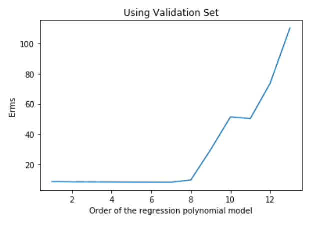
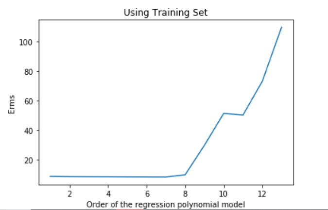
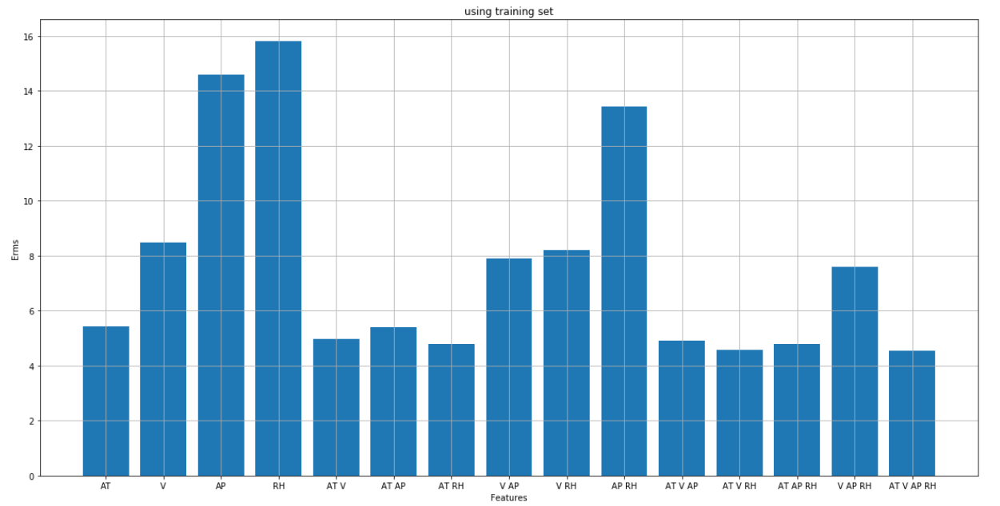
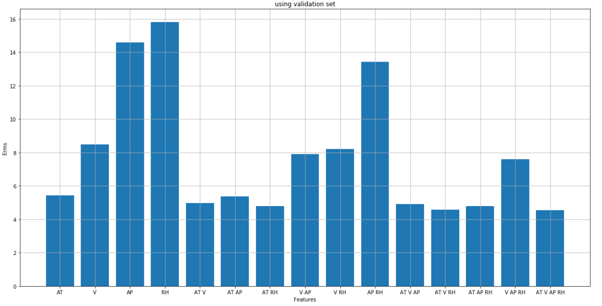
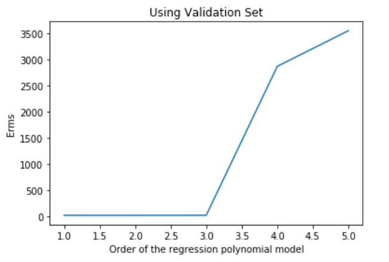

# CCP-LS-Regressor
This is Least Square (LS) regressor that can predict the net hourly electrical energy output (P) of the power plant in the CCPP dataset. You can find the dataset at http://archive.ics.uci.edu/ml/datasets/Combined+Cycle+Power+Plant

## Using Only Exhaust Vaccum (V) as an input feature

{width="5.361111111111111in"
height="3.641088145231846in"}{width="5.5in"
height="3.5279910323709536in"}

### Accordingly, the best-chosen order of polynomial model is 8th

On Testing using the best polynomial order (8^th^), Erms turned out to
be the following

Erms using testing data: 8.243256759768153

## Finding the best subset of featuresbest chosen polynomial)

{width="6.5in" height="3.2944444444444443in"}

{width="6.5in" height="3.2944444444444443in"}

### As shown in the 2 bar graphs below, the best subset of features( the one with the least error) is \[AT, V,AP,RH\]

## All Features combined as input

{width="6.5in" height="3.310416666666667in"}

{width="4.829861111111111in" height="3.25in"}

### Accordingly, the best-chosen order of polynomial model is 3rd 

